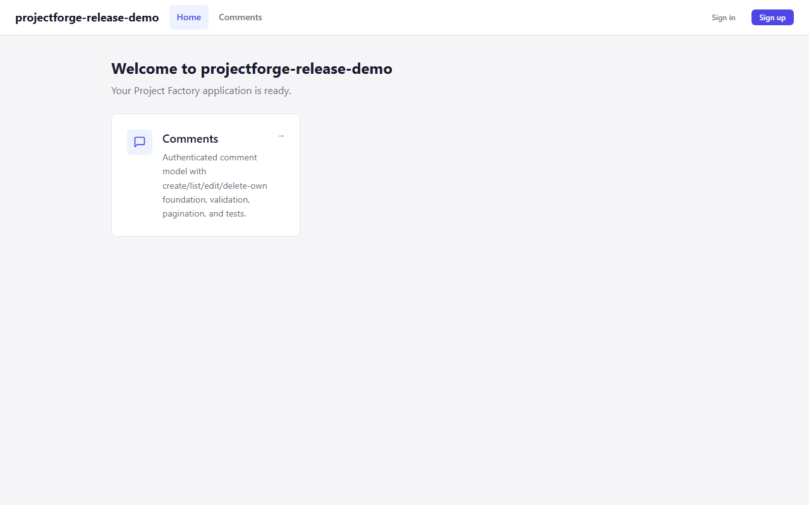
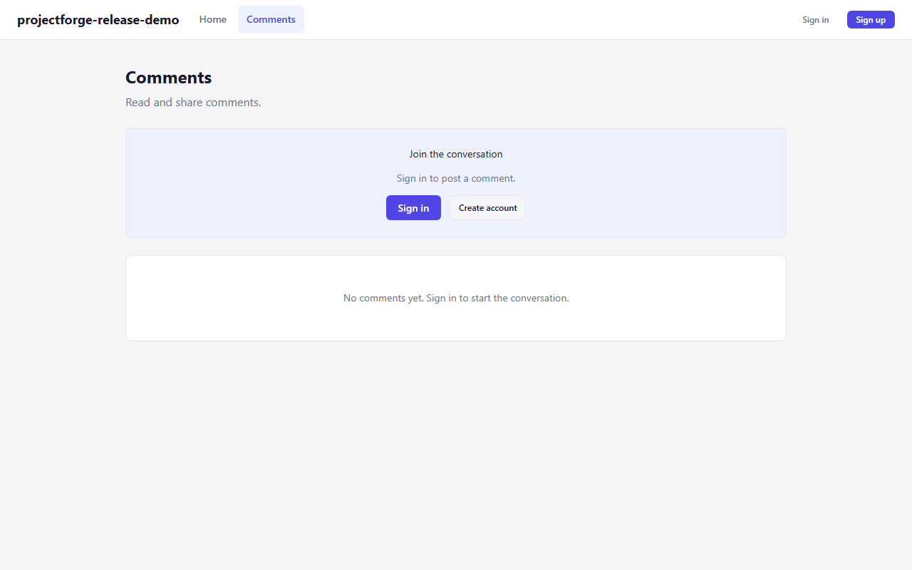
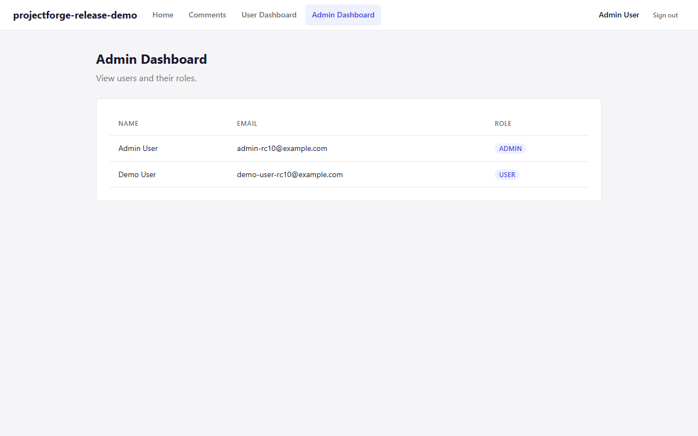

# ProjectForge

**Local-first CLI that generates production-ready full-stack TypeScript projects from composable modules.**

> **Status:** v0.1.0 released on GitHub (2026-08-18). The npm package is NOT published.

ProjectForge lets you scaffold a complete application — React frontend, Hono API, Cloudflare D1 database, shared packages — and then extend it by adding modules. Comments, user dashboards, admin panels with RBAC, authentication... each module is a tested, composable piece. Add them with a single command. Never scaffold boilerplate by hand again.

---

## What It Is

- A CLI that **generates** projects from a starter template
- A **module system** — `projectforge add comments` installs a feature with its routes, tests, database migrations, and dependencies
- **Deterministic** — same inputs always produce the same project, verified by SHA256 provenance
- **Transactional** — every mutation is executed under backup, verification, and rollback
- **Local only** — no cloud account, no telemetry, no central service

## What It Is Not

- Not a package manager or build tool
- Not an online service or SaaS
- Not a deployment platform
- Not a finished application — it's a project generator

---

## Screenshots

| Anonymous home | Anonymous comments | Admin users (desktop) |
| --- | --- | --- |
|  |  |  |

---

## Quick Start

```bash
# From the standalone v0.1.0 GitHub Release tarball:
npm install ./projectforge-cli-0.1.0.tgz
npx projectforge create my-app
cd my-app

# Add modules:
npx projectforge add comments
npx projectforge add user-dashboard
npx projectforge add admin-dashboard

# Install, migrate, and run:
pnpm install
cd apps/api && npx wrangler d1 migrations apply my-app-db --local && cd ../..
pnpm -r build

# Start API:
cd apps/api && npx wrangler dev --port 8787

# Start Web (separate terminal):
cd apps/web && npx vite --port 5173
```

---

## Generated Stack

| Layer | Technology |
|-------|-----------|
| **Web** | React 18 · Vite · React Router v6 |
| **API** | Hono · Cloudflare Workers · Wrangler |
| **Database** | Cloudflare D1 (SQLite) · Drizzle ORM |
| **Auth** | Better Auth (email/password) · HttpOnly session cookies |
| **RBAC** | Roles + permissions backed by D1 |
| **Testing** | Vitest · Testing Library · Playwright |

---

## Modules

| Module | Description |
|--------|-------------|
| `database-d1` | D1 binding, typed queries, migration runner |
| `auth` | Sign-up, sign-in, sessions, cookie-based auth |
| `rbac` | Roles and permissions enforced at the API layer |
| `comments` | Authenticated comment model (create, list, edit, delete) |
| `user-dashboard` | Authenticated user profile dashboard |
| `admin-dashboard` | Admin-only user list with role badges |

All modules resolve transitive dependencies automatically — adding `admin-dashboard` pulls in `rbac`, `auth`, and `database-d1`.

---

## Commands

```bash
projectforge create <name> [starter]   # Generate a new project
projectforge add <module...>           # Add modules with dependencies
projectforge sync                      # Reconcile lock with config
projectforge status                    # Show project state
projectforge plan                      # Show the plan without executing
projectforge list                      # List available starters and modules
projectforge help                      # Command reference
```

---

## Project Structure (Generated)

```
my-app/
├── apps/
│   ├── api/          # Hono API (Cloudflare Workers)
│   └── web/          # React + Vite frontend
├── packages/         # Shared config, contracts, test-utils, ui
├── docs/             # Project documentation site (VitePress)
├── migrations/       # D1 SQL migration files
├── projectforge.json # Project configuration
└── package.json      # pnpm workspace root
```

---

## Testing

```bash
# Run all workspace tests:
pnpm -r test

# With typecheck, lint, and build:
pnpm -r typecheck
pnpm lint
pnpm -r build
pnpm -r test
```

The source repository includes over 260 tests across 6 packages covering schemas, the planning engine, registry loading, and CLI integration tests including installed-artifact, all-modules, rollback, and provenance verification.

---

## Requirements

- **Node.js** ≥ 18
- **pnpm** ≥ 9
- **Cloudflare Wrangler** (for local D1 development)
- **Windows, macOS, or Linux** — tested on all three

---

## Security

- Authentication via Better Auth with HttpOnly session cookies
- RBAC enforcement at the API layer (not client-side)
- CORS/CSRF origin boundary on all auth routes
- Secret redaction in logs and error messages
- See [SECURITY.md](SECURITY.md) for reporting vulnerabilities

---

## Known Limitations (v0.1.0)

- Migrations are not executed by the CLI; generated projects include a D1 migration workflow via Wrangler
- Diff-based `sync` and module uninstall are not yet implemented
- The registry is bundled with the CLI; no external registry service exists
- This is an early pre-1.0 release — APIs and generated output may change before v1.0.0

---

## Documentation

- [Quick Start Guide](apps/docs/start/quickstart.md)
- [Module Reference](apps/docs/reference/modules.md)
- [CLI Reference](apps/docs/reference/cli.md)
- [Contributing](CONTRIBUTING.md)

---

## License

MIT — see [LICENSE](LICENSE) for details.

---

*ProjectForge v0.1.0 is released on GitHub (2026-08-18). The npm package is NOT published.*

*Created and maintained by Pouya Fereydouni.*
